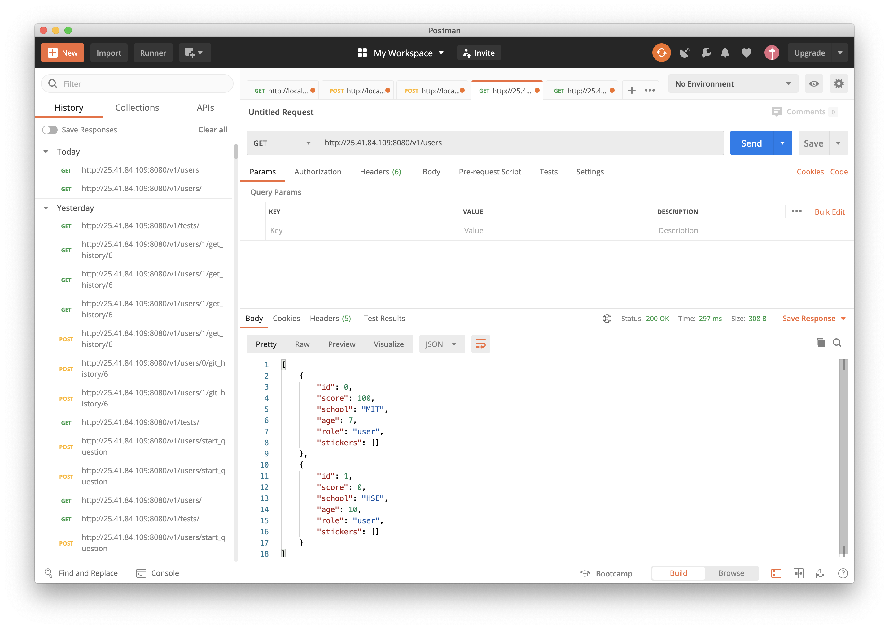

# REST API for TApp
## How to use 
You need to get hamachi (xD). Probably you have to register a LogMeIn account. Network ID: `jhoysbou-server`, password: `kvfg6Q29`.
Now IPv4 address is an IP address than you can use to send requests. I prefer to use `Postman` to do it.
To send a simple requests you just need to write correct address with port `8080` and select a right type.
#### Example: 
My IPv4 is `25.41.84.109`, as you see, I use `8080` port  with `GET` request to `v1/users`.

## Authentication
In progress...
## Methods
-> Right arrow means `request` JSON body \
<- Left arrow means `response` JSON body

### Users
`Get` on `v1/users` will return a list of all users \
<-
```json
[
    {
      "id": 0,
      "score": 100,
      "school": "MIT",
      "age": 7,
      "role": "user",
      "stickers": []
    },
    {
      "id": 1,
      "score": 0,
      "school": "HSE",
      "age": 10,
      "role": "user",
      "stickers": []
    }
]
``` 


`Put` on `v1/users/{id}` where id - vk id will create entity in database \
-> 
```json
{
    "score": 10,
    "school": "",
    "age": 16,
    "role": "user"
}
```

`Get` on `v1/users/{id}` will return a single user with this id 
```json
{
      "id": 1,
      "score": 0,
      "school": "HSE",
      "age": 10,
      "role": "user",
      "stickers": []
}
```

`Patch` on `v1/users/{id}` will update user with `id`  \
-> 
```json
{
    "score": 10,
    "school": "",
    "age": 16,
    "role": "user"
}
```

`Delete` on `v1/users/{id}` will delete user \
`*NOTHING*`

### Tests
`Get` on `v1/tests` will return a list of all tests \
<-
```json
[
    {
        "id": 4,
        "img": "https://www.freepik.com/download-file/5617352",
        "title": "My title",
        "description": "Best test test ever",
        "questions": [],
        "date": "21-07-2020 00:00:00"
    },
    {
        "id": 6,
        "img": "https://media.gettyimages.com/photos/abstract-network-background-picture-id836272842?s=612x612",
        "title": "Как приручить интеграл Римана?",
        "description": "descidghd",
        "questions": [
            {
                "id": 1,
                "questionText": "nothing",
                "reward": 0,
                "img": null,
                "answers": [],
                "serialNumber": 0
            }
        ],
        "date": "01-10-2020 00:01:01"
    }
]
```

`Get` on `v1/tests/{id}` will return a single test with this `id` \
<-
```json
{
    "id": 6,
    "img": "https://media.gettyimages.com/photos/abstract-network-background-picture-id836272842?s=612x612",
    "title": "Как приручить интеграл Римана?",
    "description": "descidghd",
    "questions": [
        {
            "id": 1,
            "questionText": "nothing",
            "reward": 0,
            "img": null,
            "answers": [],
            "serialNumber": 0
        }
    ],
    "date": "01-10-2020 00:01:01"
}
```

`Post` on `v1/tests` will create a new entity of test in database and return its id \
Attention data in format `dd-MM-yyyy HH:mm:ss`

-> 
```json
{
    "img": "https://media.gettyimages.com/photos/abstract-network-background-picture-id836272842?s=612x612",
    "title": "Как приручить интеграл Римана?",
    "description": "descidghd",
    "questions": [
        {
            "questionText": "nothing",
            "pathToImage": "None",
            "answers": [],
            "serialNumber": 0
        }
    ],
    "date": "01-10-2020 00:01:01"
}
```
Delete on `v1/tests/{id}` will delete test with id = `id` \
`*NOTHING*`

### Images
`POST` on `v1/media` will upload an attached image to Amazon S3 cloud storage and return url to get it. 
Images must have `img` key.\
<-
```json
{
  "url": "https://tapp-media.s3.eu-north-1.amazonaws.com/test_images/a.jpg" 
}
```
